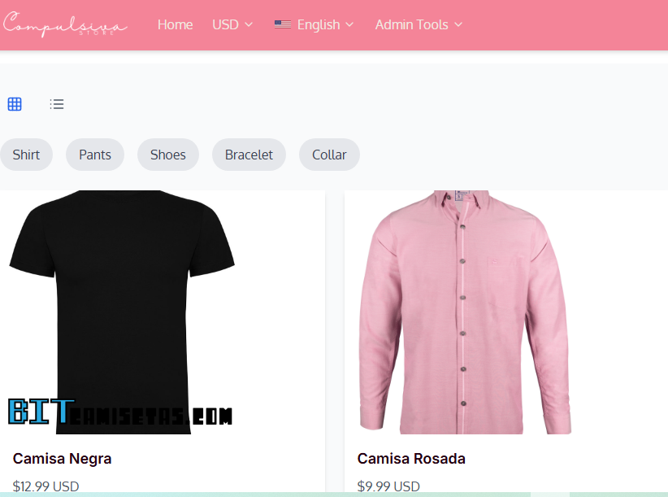
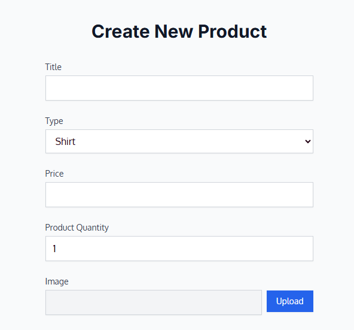
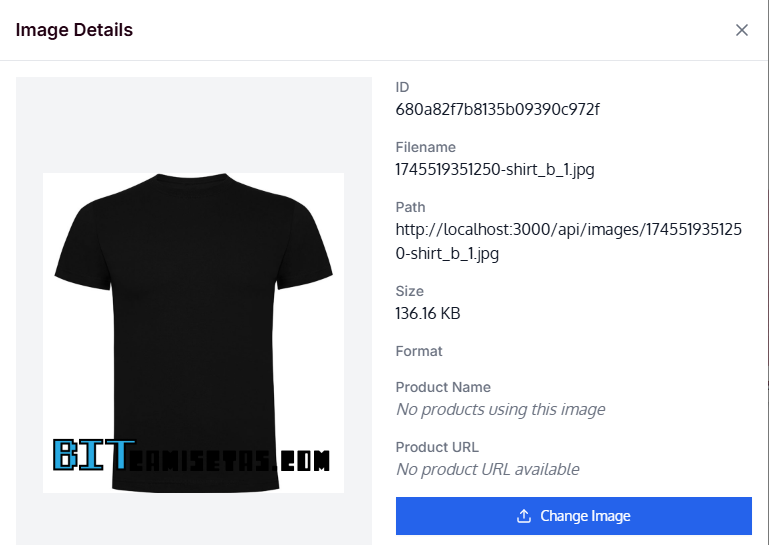
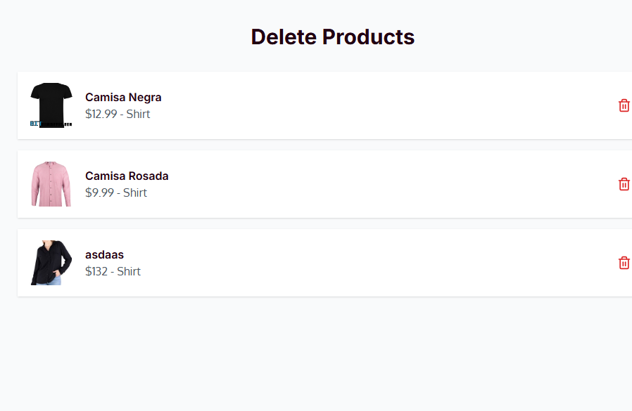
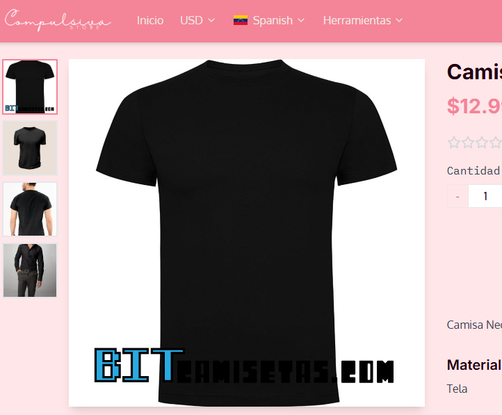
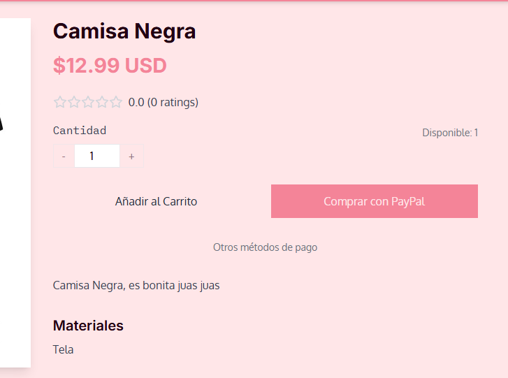

## Table of Contents
1. [Overview](#overview)
2. [Screenshots](#screenshots)
3. [Role](#role)
4. [Goal](#goal)
5. [User Testing](#user-testing)
6. [Final Thoughts](#final-thoughts)

---

## Overview
**Compulsiva Store** features a front-end design made with TypeScript, React, Vite and TailwindCSS. A back-end structure made with Node.JS, it has a login and registration system linked to a MongoDB Database, in which there is images, users, purchases, products, drafts, comments, and other user details. It was created to allow one administrator to create, edit, or delete products as quickly and easily as possible. It features a single administrator tool, located in the header, making page management easier. It is also available in English and Spanish. If the page takes too long to fetch the database information is due the free hosting service. Please wait 50 seconds. 

---

## Screenshots

---

## Role
**Lead Developer**

---

## Goal
1. Create an attractive, professional market app were the admin can create, edit or delete a product
2. Build a simple to watch site that provides users the option to see, filter and pick products from the home page
3. Add a Shopping section, image preview, zoomable image preview, recommended product, rating, views, comments, and a user database to attract potential users.

---

## Challenges and Learnings
1. **Payment Methods:** We added 1 payment method, PayPal. since it's the easist and famous.
2. **Image to database:** MongoDB provides only 512mb of storage in the free plan. I made sure there were no extra images uploads wandering around in the database so the admin wouldn't run out of space.
3. **Navigation:** Ensured the site meets accessibility standards, improving navigation for all users.

---

## Final Thoughts
1. **Design Matters:** A more attractive user interface will be added for the client. I like to maintain quality in my work!
2. **Continuous Improvement:** We continue to add new features and fix any bugs in our latest updates, while learning as we go.

---