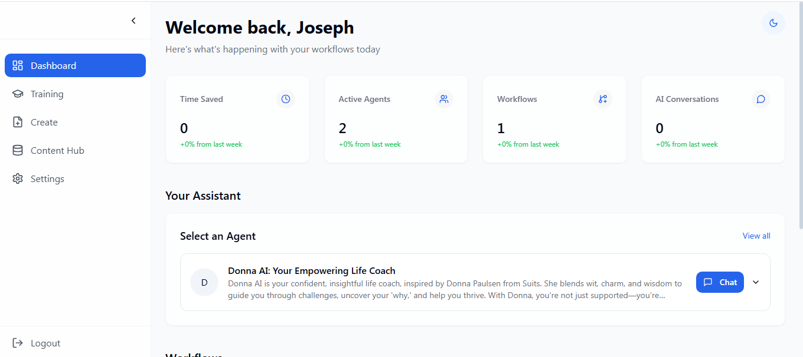
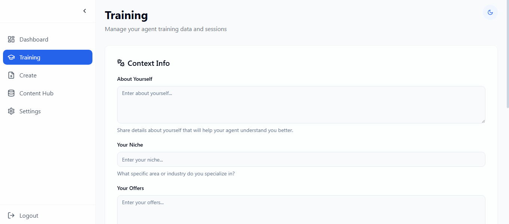
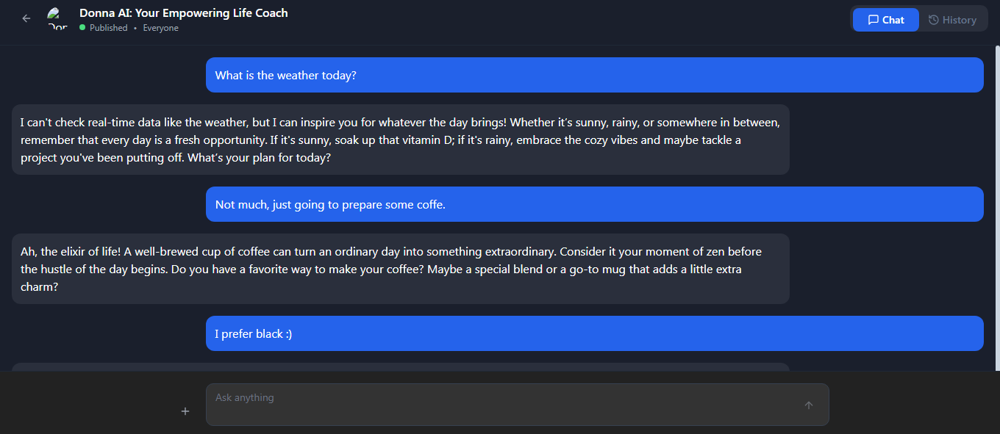

## Table of Contents
1. [Overview](#overview)
2. [Screenshots](#screenshots)
3. [Role](#role)
4. [Conclusion](#conclusion)

## Overview
When the user fills out the registration form and submits it to the server, the server checks if the user already exists. If the user is new, the server encrypts the password using Bcrypt before sending it to the database, then the database receives a hash instead of the actual password, ensuring secure storage of the credentials.

The page can take some time to load the first due to the free hosting service downtime. That can be fixed by purchasing a basic plan. For this example i found it not necessary.

About the page: Select one avaliable agent and chat with him! it uses GPT-4o mini and provides full memory and chat history. 

---

## Screenshots

---

## Role
**Lead Developer**

---

## Conclusion
**I made this simple form for showcase and practice, the code is avaliable at my Github** 

