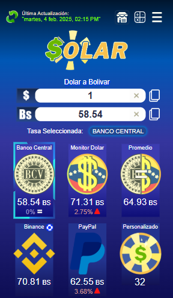
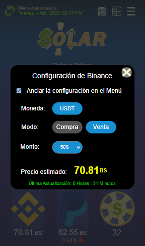
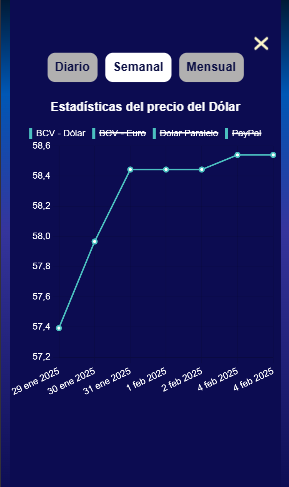
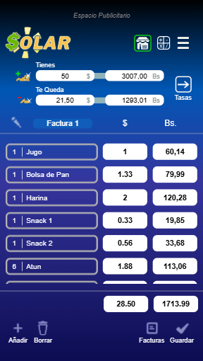
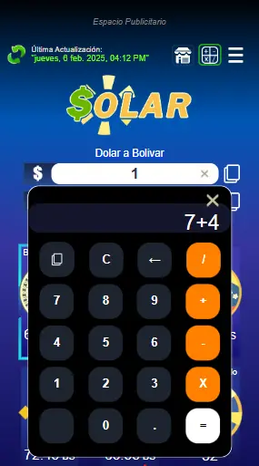
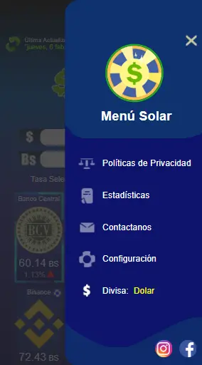

## Table of Contents
1. [Overview](#overview)
2. [Screenshots](#screenshots)
3. [Role](#role)
4. [Goal](#goal)
5. [User Testing](#user-testing)
6. [Challenges and Learnings](#challenges-and-learnings)
7. [Final Thoughts](#final-thoughts)

---

## Overview
**Solar - Dólar en Venezuela** Solar is a modern app, created to give Venezuelans the ability to view and calculate the value of the dollar to the local currency, updated every 30 minutes. With the added option of being able to create a shopping list and save money!

---

## Screenshots

---

## 👨‍💻 Role
**Lead Developer**

---

## 🎯 Goal
1. Create an attractive, professional app to market and help save people's time.
2. Build a great shopping list so people can save money when going to the market.
3. Add Binance (USDT) as a currency to calculate it in bolivars, since it fluctuates a lot.

---

## 🧪 User Testing
We tested the app prototype with 20 participants for the PlayStore (Open, Closed and Internal test) and gathered insights:
- **Ease of Navigation:** All testers found the site easy and intuitive to navigate.
- **Values was on point:** All testers verified that the rate values ​​displayed were correct.
- **Useful App:** 18/20 testers found the app very useful and potentially better than the competition.

---

## ⚙️ Challenges and Learnings
1. **Budget:** To make the app update 24 hours a day, it was necessary to install a bot, the cost of which exceeded the planned budget at the moment.
2. **Data Protection:** To avoid a possible data leak in our values, data encryption was created with access keys.
3. **Accessibility:** Ensured the site meets accessibility standards, improving usability for all users.

---

## ✨ Final Thoughts
1. **Design Matters:** A clean and professional design is our primary duty along with good and clean code.
2. **Continuous Improvement:** We continue to add new features and fix any bugs in our latest updates, while learning as we go.

---